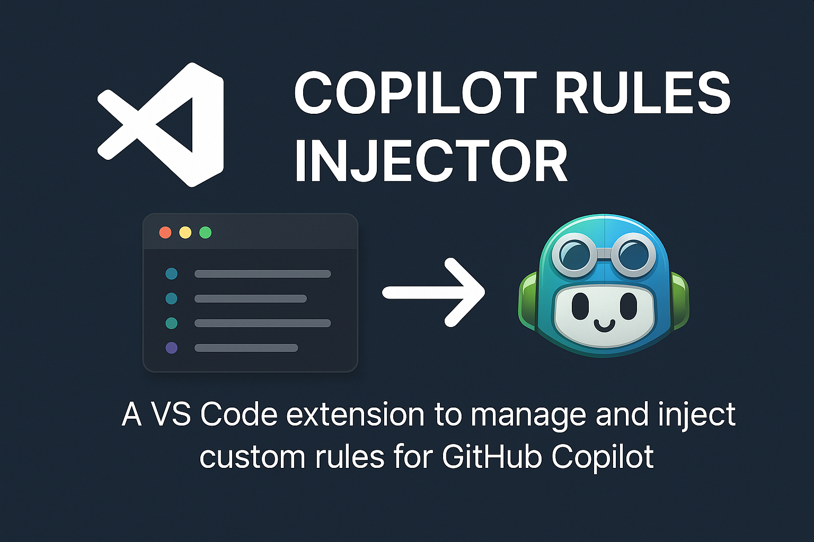

# Copilot Rules Injector

<div align="center">
  
  <p>Un'estensione VS Code che consente di gestire e iniettare regole personalizzate per GitHub Copilot.</p>
</div>

## Funzionalità

 **Gestione regole per GitHub Copilot**: seleziona, personalizza e inietta regole direttamente nel tuo progetto

- **Template per linguaggi/framework**: aggiungi facilmente regole predefinite per JavaScript, Python, TypeScript, React, Node.js, Django e Flask
- **Editor visuale regole**: interfaccia drag and drop per riordinare, aggiungere e modificare le regole
- **Esportazione/importazione**: condividi le tue regole con il team o importale in nuovi progetti
- **Rilevamento automatico**: suggerimenti contestuali basati sul codice del tuo progetto
- **Integrazione GitHub**: crea automaticamente un file `.github/copilot-instructions.md` con le regole selezionate

## Installazione

1. Apri VS Code
2. Vai all'estensioni (Ctrl+Shift+X)
3. Cerca "Copilot Rules Injector"
4. Clicca su Install

## Utilizzo

### Sidebar


L'estensione aggiunge una sidebar nell'activity bar di VS Code con le seguenti sezioni:

- **Regole di default (📚)**: regole generali consigliate per qualsiasi progetto
- **Regole personali (👤)**: regole personalizzate che puoi aggiungere e modificare
- **Regole della memoria (🗄️)**: regole per mantenere il contesto del progetto
- **Template di regole (📚)**: regole predefinite per linguaggi/framework specifici

Ogni categoria mostra anche un badge con il numero di regole attualmente selezionate.

### Editor visuale

Per aprire l'editor visuale delle regole:
1. Clicca sul pulsante "Apri editor visuale regole" nella sezione Template della sidebar
2. Oppure usa il comando `Copilot Rules Injector: Apri editor visuale regole` dalla palette comandi (Ctrl+Shift+P)

Nell'editor puoi:
- Selezionare/deselezionare regole di default e della memoria
- Aggiungere, modificare, eliminare regole personali
- Riordinare le regole con drag and drop
- Salvare tutte le modifiche con un solo click

### Template per linguaggi/framework

Puoi aggiungere regole specifiche per:
- JavaScript
- Python
- TypeScript
- React
- Node.js
- Django
- Flask

Basta cliccare sul linguaggio/framework nella sezione Template e selezionare le regole che vuoi aggiungere.

### Esportazione/Importazione

Per condividere le tue regole:
1. Usa il comando `Copilot Rules Injector: Esporta regole selezionate` dalla palette comandi
2. Salva il file JSON delle regole
3. Condividilo con il tuo team

Per importare regole:
1. Usa il comando `Copilot Rules Injector: Importa regole` dalla palette comandi
2. Seleziona il file JSON delle regole

## Comandi disponibili

- `Copilot Rules Injector: Apri editor visuale regole`: Apre l'editor visuale delle regole
- `Copilot Rules Injector: Esporta regole selezionate`: Esporta le regole in formato JSON
- `Copilot Rules Injector: Importa regole`: Importa regole da un file JSON
- `Copilot Rules Injector: Suggerisci regole`: Analizza il codice e suggerisce regole contestuali
- `Copilot Rules Injector: Inietta regole selezionate`: Crea/aggiorna il file `.github/copilot-instructions.md` con le regole selezionate

## Screenshots

*[Inserire qui screenshot dell'estensione con sidebar, editor visuale, ecc.]*

## Come funziona

L'estensione salva tutte le regole selezionate nel file `.github/copilot-instructions.md`, che è il percorso ufficiale riconosciuto da GitHub Copilot per le istruzioni personalizzate. Questo consente a Copilot di generare codice in linea con le tue preferenze e quelle del tuo team.

## Status Bar

<div align="center">
   <strong>Regole Copilot: X</strong>
</div>

L'estensione aggiunge un indicatore nella barra di stato che mostra il numero totale di regole attive. Cliccando su questo indicatore si aprirà l'editor visuale delle regole.

## Contribuire

Contributi sono benvenuti! Sentiti libero di aprire issues o pull requests su GitHub.

## Licenza

[MIT](LICENSE)

## Installazione manuale (non disponibile sul marketplace)

Poiché questa estensione non è ancora disponibile nel marketplace di VS Code, è necessario compilarla e installarla manualmente:

### Prerequisiti
- [Node.js](https://nodejs.org/) (versione 16 o superiore)
- [Git](https://git-scm.com/)
- [Visual Studio Code](https://code.visualstudio.com/)

### Passi per l'installazione
1. Clona il repository:
   ```bash
   git clone https://github.com/tuo-username/copilot-rules-injector.git
   cd copilot-rules-injector
   ```

2. Installa le dipendenze:
   ```bash
   npm install
   ```

3. Compila l'estensione:
   ```bash
   npm run watch
   ```
   Questo avvierà la compilazione in modalità watch, che ricompilerà automaticamente quando modifichi i file sorgente.

4. Apri la cartella dell'estensione in VS Code:
   ```bash
   code .
   ```

5. Premi F5 per avviare una nuova finestra di VS Code con l'estensione caricata in modalità debug.

### Installazione come file VSIX

Se preferisci installare l'estensione come file VSIX:

1. Compila l'estensione in modalità produzione:
   ```bash
   npm run package
   ```

2. Installa l'estensione dalla riga di comando:
   ```bash
   code --install-extension copilot-rules-injector-0.0.1.vsix
   ```
   Oppure dalla UI di VS Code:
   - Vai nel pannello Estensioni (Ctrl+Shift+X)
   - Clicca sull'icona "..." in alto a destra
   - Seleziona "Installa da VSIX..."
   - Naviga e seleziona il file .vsix generato

### Aggiornamenti

Per aggiornare l'estensione all'ultima versione:

1. Aggiorna il repository:
   ```bash
   git pull origin main
   ```

2. Reinstalla le dipendenze e ricompila:
   ```bash
   npm install
   npm run watch
   ```

3. Riavvia VS Code o premi F5 per avviare una nuova finestra di debug.
